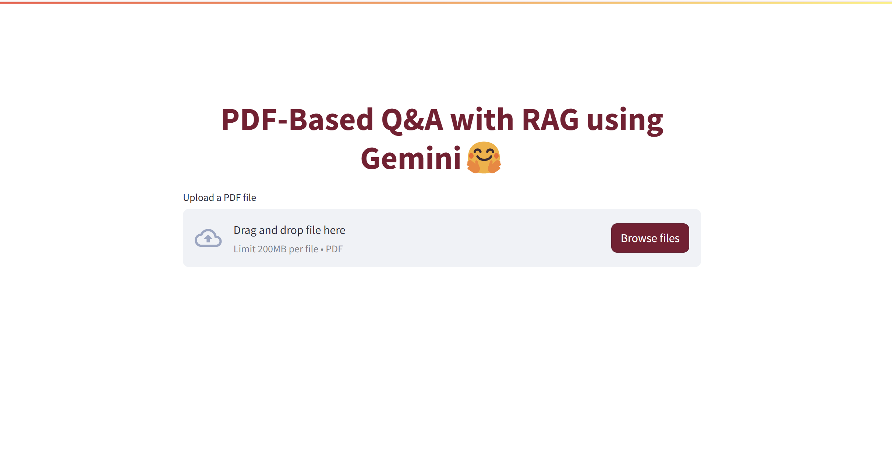

This project implements a Retrieval-Augmented Generation (RAG) system that enables users to interact with PDF documents through natural language queries. At its core, it combines the power of Google's Gemini language model with a retrieval system to provide accurate, context-aware answers grounded in the content of uploaded PDF files.

